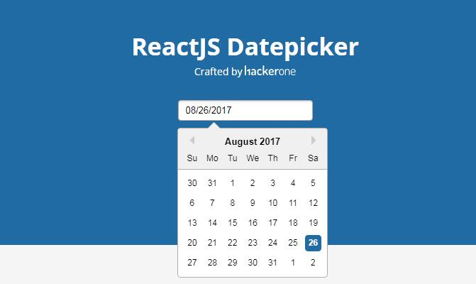

<h1 align="center">Retrospective-Tracker</h1>

> Browser extension designed to conveniently create and track weekly retrospectives for the MLH Fellowship.

<div align="center">
    
</div>

## Description

Weekly retrospectives are some of the most important reflective activities in the MLH Fellowship. However, the current process of only thinking up retrospective green, yellow, red notes during Friday's standup meetings, in the short time frame of 5-7 minutes is limiting in terms of the deep reflection and retrospection that one is supposed to undergo. Retrospective-Tracker aims to partially solve this issue by incorporating a convenient manner to jot down retrospective one-liners throughout the week, so that fellows can use the time on Fridays to reflect more deeply about these one-liners, to achieve a deeper level of retrospection.

## Features

### Current

Contains all retrospective notes for current week as reflected in the header, e.g. `8 Mar - 12 Mar`. Dates of the current week are automatically updated as a new week starts, and the old week is automatically reflected as `Previous Week` in the Previous tab. Hence, this should always be the primary list to edit.

| Feature          | Description                                                                                                                     |
| ---------------- | ------------------------------------------------------------------------------------------------------------------------------- |
| Add item         | Add new item to category                                                                                                        |
| Edit item        | Edit selected item with simple click                                                                                            |
| Delete item      | Delete item from list                                                                                                           |
| Drag & Drop item | Drag and drop items between categories                                                                                          |
| Copy             | Copy list to markdown-formatted text                                                                                            |
| Start new week   | Changes current week to one week into the future, pushing back the current week to Previous; capped at one week into the future |

### Previous

| Feature            | Description                                                                                                |
| ------------------ | ---------------------------------------------------------------------------------------------------------- |
| Current's features | All features in Current are applicable to individual weeks' lists, with the exception of starting new week |
| Copy all           | Copy all lists to markdown-formatted text, organized by dates                                              |

### Action Items

Contains all Yellow and Red items from all previous weeks' lists. Any changes reflected in previous weeks' items are reflected in this list while they still exist in this list.

| Feature                | Description                                        |
| ---------------------- | -------------------------------------------------- |
| Move to Current Green  | Moves action item to Current tab's Green category  |
| Move to Current Yellow | Moves action item to Current tab's Yellow category |
| Move to Current Red    | Moves action item to Current tab's Red category    |
| Resolve                | Removes item from Action Items list                |

## Install

Clone repository.

```sh
git clone git@github.com:zhixiangteoh/retrospective-tracker.git
cd retrospective-tracker
```

Install dependencies.

```sh
yarn install
```

Build extension locally

```sh
yarn build
```

## Usage

Enable extension within browser:

1. For Firefox, follow [this](https://developer.mozilla.org/en-US/docs/Mozilla/Add-ons/WebExtensions/Your_first_WebExtension#installing)
1. For Chrome, navigate to `chrome://extensions`
1. Enable Developer mode (top right)
1. Click `Load unpacked` (top left) and select the `retrospective-tracker/build` folder you just built
1. Have fun!

## Made possible with

<div>
    
    
    
    
    
</div>
